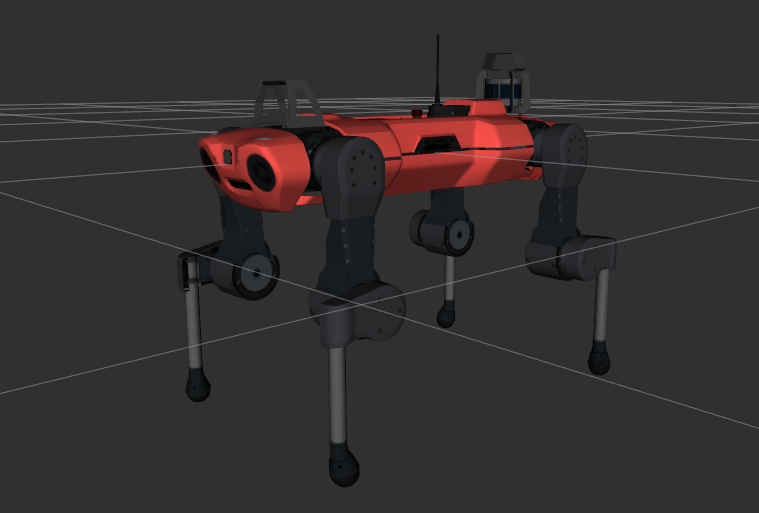

# Anybotics Anymal_C Description
This repository contains the urdf model of lite3.



Tested environment:
* Ubuntu 24.04
    * ROS2 Jazzy

## Build
```bash
cd ~/ros2_ws
colcon build --packages-up-to anymal_c_description --symlink-install
```

## Visualize the robot
To visualize and check the configuration of the robot in rviz, simply launch:
```bash
source ~/ros2_ws/install/setup.bash
ros2 launch anymal_c_description visualize.launch.py
```

## Launch ROS2 Control
### Mujoco Simulator
* Unitree Guide Controller
  ```bash
  source ~/ros2_ws/install/setup.bash
  ros2 launch unitree_guide_controller mujoco.launch.py pkg_description:=anymal_c_description
  ```
* OCS2 Quadruped Controller
  ```bash
  source ~/ros2_ws/install/setup.bash
  ros2 launch ocs2_quadruped_controller mujoco.launch.py pkg_description:=anymal_c_description
  ```
* Legged Gym Controller
    ```bash
  source ~/ros2_ws/install/setup.bash
  ros2 launch rl_quadruped_controller mujoco.launch.py pkg_description:=anymal_c_description
  ```