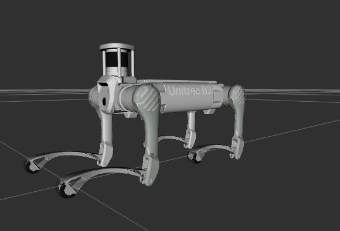

# Unitree B2 Description
This repository contains the urdf model of b2.



## Build
```bash
cd ~/ros2_ws
colcon build --packages-up-to b2_description
```

## Visualize the robot
To visualize and check the configuration of the robot in rviz, simply launch:
```bash
source ~/ros2_ws/install/setup.bash
ros2 launch b2_description visualize.launch.py
```

## Launch ROS2 Control
* Unitree Guide Controller
  ```bash
  source ~/ros2_ws/install/setup.bash
  ros2 launch b2_description unitree_guide.launch.py
  ```
* OCS2 Quadruped Controller
  ```bash
  source ~/ros2_ws/install/setup.bash
  ros2 launch b2_description ocs2_control.launch.py
  ```


