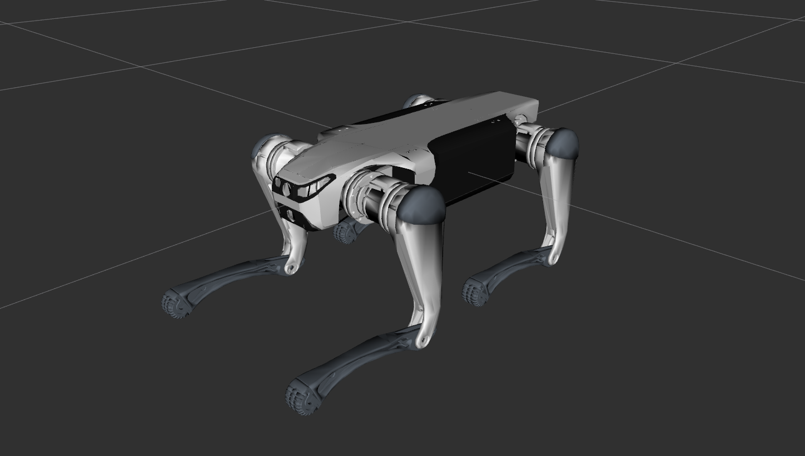

# DeepRobotics Lite3 Description

This repository contains the urdf model of lite3.



Tested environment:

* Ubuntu 24.04
    * ROS2 Jazzy

## Build

```bash
cd ~/ros2_ws
colcon build --packages-up-to lite3_description --symlink-install
```

## Visualize the robot

To visualize and check the configuration of the robot in rviz, simply launch:

```bash
source ~/ros2_ws/install/setup.bash
ros2 launch lite3_description visualize.launch.py
```

## Launch ROS2 Control

### Mujoco Simulator

* Unitree Guide Controller
  ```bash
  source ~/ros2_ws/install/setup.bash
  ros2 launch unitree_guide_controller mujoco.launch.py pkg_description:=lite3_description
  ```
* OCS2 Quadruped Controller
  ```bash
  source ~/ros2_ws/install/setup.bash
  ros2 launch ocs2_quadruped_controller mujoco.launch.py pkg_description:=lite3_description
  ```
* RL Quadruped Controller
  ```bash
  source ~/ros2_ws/install/setup.bash
  ros2 launch rl_quadruped_controller mujoco.launch.py pkg_description:=lite3_description
  ```

### Gazebo Classic 11 (ROS2 Humble)

* Unitree Guide Controller
  ```bash
  source ~/ros2_ws/install/setup.bash
  ros2 launch unitree_guide_controller gazebo_classic.launch.py pkg_description:=lite3_description
  ```

### Gazebo Harmonic (ROS2 Jazzy)

* Unitree Guide Controller
  ```bash
  source ~/ros2_ws/install/setup.bash
  ros2 launch unitree_guide_controller gazebo.launch.py pkg_description:=lite3_description height:=0.43
  ```
* OCS2 Quadruped Controller
  ```bash
  source ~/ros2_ws/install/setup.bash
  ros2 launch ocs2_quadruped_controller gazebo.launch.py pkg_description:=lite3_description height:=0.43
  ```
  
### Gazebo Playground (ROS2 Jazzy)
* OCS2 Quadruped Controller
  ```bash
  source ~/ros2_ws/install/setup.bash
  ros2 launch gz_quadruped_playground gazebo.launch.py pkg_description:=lite3_description controller:=ocs2 world:=warehouse
   ```