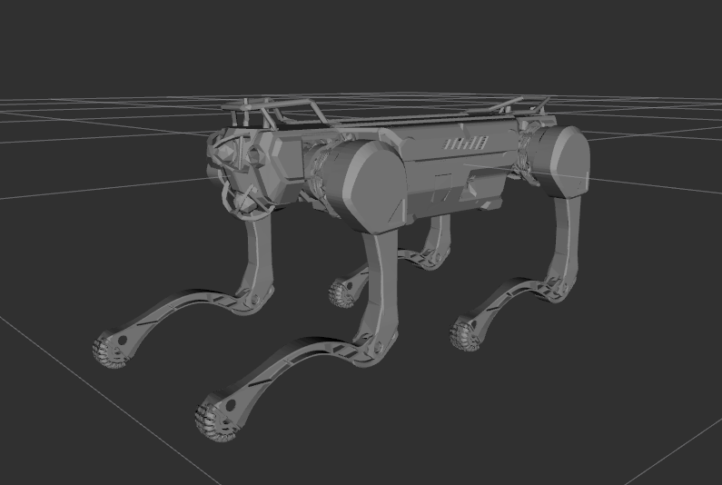

# DeepRobotics X30 Description
This repository contains the urdf model of x30.



Tested environment:
* Ubuntu 24.04
    * ROS2 Jazzy
* Ubuntu 22.04
    * ROS2 Humble

## Build
```bash
cd ~/ros2_ws
colcon build --packages-up-to x30_description --symlink-install
```

## Visualize the robot
To visualize and check the configuration of the robot in rviz, simply launch:
```bash
source ~/ros2_ws/install/setup.bash
ros2 launch x30_description visualize.launch.py
```

## Launch ROS2 Control
### Mujoco Simulator
* Unitree Guide Controller
  ```bash
  source ~/ros2_ws/install/setup.bash
  ros2 launch unitree_guide_controller mujoco.launch.py pkg_description:=x30_description
  ```
* OCS2 Quadruped Controller
  ```bash
  source ~/ros2_ws/install/setup.bash
  ros2 launch ocs2_quadruped_controller mujoco.launch.py pkg_description:=x30_description
  ```
* RL Quadruped Controller
  ```bash
  source ~/ros2_ws/install/setup.bash
  ros2 launch rl_quadruped_controller mujoco.launch.py pkg_description:=x30_description model_folder:=legged_gym
  ```


### Gazebo Classic 11 (ROS2 Humble)

* Unitree Guide Controller
  ```bash
  source ~/ros2_ws/install/setup.bash
  ros2 launch unitree_guide_controller gazebo_classic.launch.py pkg_description:=x30_description height:=0.64
  ```

### Gazebo Harmonic (ROS2 Jazzy)
* Unitree Guide Controller
  ```bash
  source ~/ros2_ws/install/setup.bash
  ros2 launch unitree_guide_controller gazebo.launch.py pkg_description:=x30_description height:=0.64
  ```
* Legged Gym Controller
  ```bash
  source ~/ros2_ws/install/setup.bash
  ros2 launch x30_description gazebo_rl_control.launch.py
  ```