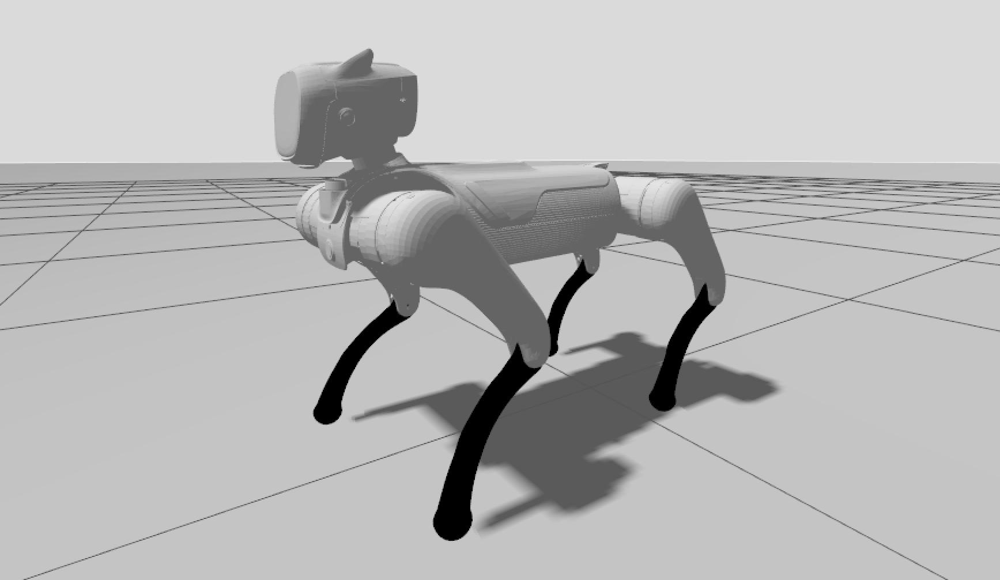

# Magicdog Description

## Overview

This package includes a quadruped robot description (URDF) for the [Magicdog](https://www.magiclab.top/dog), developed by Magiclab Robotics.



## Build

```bash
cd ~/ros2_ws
colcon build --packages-up-to magicdog_description --symlink-install
```

## Visualize the robot

To visualize and check the configuration of the robot in rviz, simply launch:

```bash
source ~/ros2_ws/install/setup.bash
ros2 launch magicdog_description visualize.launch.py
```

### Gazebo Harmonic

* Unitree Guide Controller
  ```bash
  source ~/ros2_ws/install/setup.bash
  ros2 launch unitree_guide_controller gazebo.launch.py pkg_description:=magicdog_description
  ```

