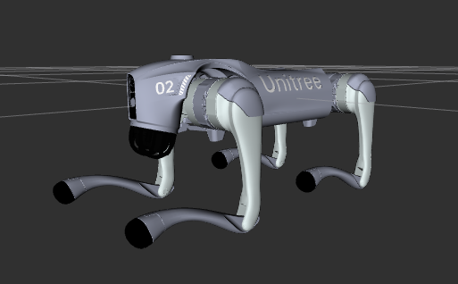

# Unitree Go2 Description

This repository contains the urdf model of go2.



Tested environment:

* Ubuntu 24.04
    * ROS2 Jazzy
* Ubuntu 22.04
    * ROS2 Humble

## 1. Build

```bash
cd ~/ros2_ws
colcon build --packages-up-to go2_description --symlink-install
```

## 2. Visualize the robot

To visualize and check the configuration of the robot in rviz, simply launch:

```bash
source ~/ros2_ws/install/setup.bash
ros2 launch go2_description visualize.launch.py
```

## 3. Launch ROS2 Control

### 3.1 Mujoco Simulator or Real Go2 Robot
> **About Real Go2 Robot**: To switch the Unitree Hardware Interface to the real robot, you need to change the config at `xacro/ros2_control.xacro`. 
> * Config guide could be found at [UnitreeHardwareInterface](../../../hardwares/hardware_unitree_mujoco)
> * Don't forget to disable the **Official Locomotion Controller** in the robot before the test
> * To use Unitree's remote controller, see [UnitreeJoystickInput](../../../commands/unitree_joystick_input) 
> * Always test on simulator first before deploying to the real robot.
* Unitree Guide Controller
  ```bash
  source ~/ros2_ws/install/setup.bash
  ros2 launch unitree_guide_controller mujoco.launch.py
  ```
* OCS2 Quadruped Controller
  ```bash
  source ~/ros2_ws/install/setup.bash
  ros2 launch ocs2_quadruped_controller mujoco.launch.py
  ```
* RL Quadruped Controller
  ```bash
  source ~/ros2_ws/install/setup.bash
  ros2 launch rl_quadruped_controller mujoco.launch.py
  ```

### 3.2 Gazebo Classic 11 (ROS2 Humble)
* Unitree Guide Controller
  ```bash
  source ~/ros2_ws/install/setup.bash
  ros2 launch unitree_guide_controller gazebo_classic.launch.py
  ```

### 3.3 Gazebo Harmonic (ROS2 Jazzy)

* Unitree Guide Controller
  ```bash
  source ~/ros2_ws/install/setup.bash
  ros2 launch unitree_guide_controller gazebo.launch.py
  ```
* OCS2 Quadruped Controller
  ```bash
  source ~/ros2_ws/install/setup.bash
  ros2 launch ocs2_quadruped_controller gazebo.launch.py
  ```
* RL Quadruped Controller
  ```bash
  source ~/ros2_ws/install/setup.bash
  ros2 launch go2_description gazebo_rl_control.launch.py
  ```

