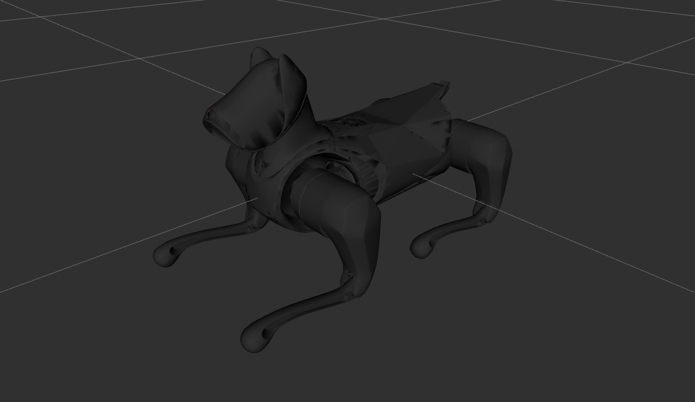

# Xiaomi Cyberdog Description

This package contains the URDF description of the Xiaomi Cyberdog robot
from [Cyberdog Simulator](https://github.com/MiRoboticsLab/cyberdog_simulator.git).



## Build

```bash
cd ~/ros2_ws
colcon build --packages-up-to cyberdog_description --symlink-install
```

## Visualize the robot

To visualize and check the configuration of the robot in rviz, simply launch:

```bash
source ~/ros2_ws/install/setup.bash
ros2 launch cyberdog_description visualize.launch.py
```

## Launch ROS2 Control

### Mujoco Simulator

* Unitree Guide Controller
  ```bash
  source ~/ros2_ws/install/setup.bash
  ros2 launch unitree_guide_controller mujoco.launch.py pkg_description:=cyberdog_description
  ```
* OCS2 Quadruped Controller
  ```bash
  source ~/ros2_ws/install/setup.bash
  ros2 launch ocs2_quadruped_controller mujoco.launch.py pkg_description:=cyberdog_description
  ```

### Gazebo Classic 11 (ROS2 Humble)

* Unitree Guide Controller
  ```bash
  source ~/ros2_ws/install/setup.bash
  ros2 launch unitree_guide_controller gazebo_classic.launch.py pkg_description:=cyberdog_description height:=0.31
  ```

### Gazebo Harmonic (ROS2 Jazzy)

* Unitree Guide Controller
  ```bash
  source ~/ros2_ws/install/setup.bash
  ros2 launch unitree_guide_controller gazebo.launch.py pkg_description:=cyberdog_description height:=0.31
  ```